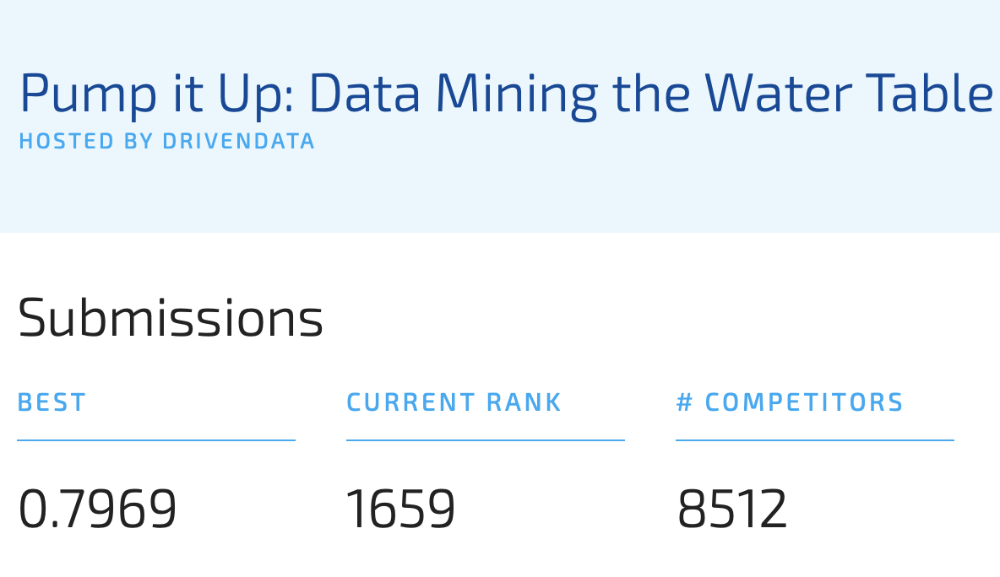

# DrivenData competition Pump it up - in R using only SVM

Código en R de mi participación en la competición de Driven Data "Pump it Up: Data Mining the Water Table", para la asignatura de Minería de Datos: Preprocesamiento y Clasificación, usando sólo SVM (Support Vector Machines).

La puntuación final obtenida es: 0.7969.



El código es reproducible y se ha realizado con esta sessionInfo:

```
> sessionInfo()
R version 3.6.2 (2019-12-12)
Platform: x86_64-apple-darwin15.6.0 (64-bit)
Running under: macOS Catalina 10.15.3

Matrix products: default
BLAS:   /System/Library/Frameworks/Accelerate.framework/Versions/A/Frameworks/vecLib.framework/Versions/A/libBLAS.dylib
LAPACK: /Library/Frameworks/R.framework/Versions/3.6/Resources/lib/libRlapack.dylib

locale:
[1] en_US.UTF-8/en_US.UTF-8/en_US.UTF-8/C/en_US.UTF-8/en_US.UTF-8

attached base packages:
[1] grid      stats     graphics  grDevices utils     datasets  methods   base     

other attached packages:
 [1] e1071_1.7-3       tictoc_1.0        caret_6.0-85      ggplot2_3.2.1    
 [5] mice_3.7.0        lattice_0.20-38   VIM_5.1.0         data.table_1.12.8
 [9] colorspace_1.4-1  dplyr_0.8.4      

loaded via a namespace (and not attached):
 [1] tidyr_1.0.2          splines_3.6.2        foreach_1.4.7        carData_3.0-3       
 [5] prodlim_2019.11.13   assertthat_0.2.1     stats4_3.6.2         sp_1.3-2            
 [9] cellranger_1.1.0     robustbase_0.93-5    ipred_0.9-9          pillar_1.4.3        
[13] backports_1.1.5      glue_1.3.1           pROC_1.16.1          minqa_1.2.4         
[17] recipes_0.1.9        Matrix_1.2-18        plyr_1.8.5           timeDate_3043.102   
[21] pkgconfig_2.0.3      broom_0.5.4          haven_2.2.0          purrr_0.3.3         
[25] scales_1.1.0         ranger_0.12.1        openxlsx_4.1.4       gower_0.2.1         
[29] lava_1.6.6           rio_0.5.16           lme4_1.1-21          tibble_2.1.3        
[33] generics_0.0.2       car_3.0-6            withr_2.1.2          pan_1.6             
[37] nnet_7.3-12          lazyeval_0.2.2       survival_3.1-8       magrittr_1.5        
[41] crayon_1.3.4         readxl_1.3.1         mitml_0.3-7          laeken_0.5.1        
[45] nlme_3.1-143         MASS_7.3-51.5        forcats_0.4.0        foreign_0.8-75      
[49] class_7.3-15         tools_3.6.2          hms_0.5.3            lifecycle_0.1.0     
[53] stringr_1.4.0        munsell_0.5.0        zip_2.0.4            compiler_3.6.2      
[57] vcd_1.4-5            rlang_0.4.4          nloptr_1.2.1         iterators_1.0.12    
[61] rstudioapi_0.10      boot_1.3-24          ModelMetrics_1.2.2.1 gtable_0.3.0        
[65] codetools_0.2-16     abind_1.4-5          curl_4.3             reshape2_1.4.3      
[69] R6_2.4.1             lubridate_1.7.4      zoo_1.8-7            jomo_2.6-10         
[73] stringi_1.4.5        parallel_3.6.2       Rcpp_1.0.3           vctrs_0.2.2         
[77] rpart_4.1-15         DEoptimR_1.0-8       tidyselect_1.0.0     lmtest_0.9-37 
```
